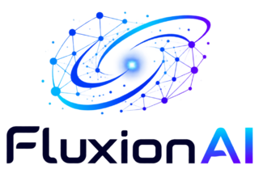

# superpowers-zh（AI 编程超能力 · 中文增强版）

🌐 **简体中文** | [繁體中文](README.zh-Hant.md) | [English (upstream)](https://github.com/obra/superpowers)

> 🦸 **superpowers（250k+ ⭐）完整汉化 + 4 个中国原创 skills** — 让 Claude Code / Copilot CLI / Hermes Agent / Cursor / Windsurf / Kiro / Gemini CLI / Qoder 等 **26 款 AI 编程工具**真正会干活。从头脑风暴到代码审查，从 TDD 到调试，每个 skill 都是经过实战验证的工作方法论。

Chinese community edition of [superpowers](https://github.com/obra/superpowers) — 20 skills across 26 AI coding tools, including full translations and China-specific development skills.

[](https://sp.aiolaola.com)
[](https://github.com/jnMetaCode/superpowers-zh)
[](https://www.npmjs.com/package/superpowers-zh)
[](https://opensource.org/licenses/MIT)
[](https://makeapullrequest.com)

> 📖 **免费配套学习** → [从零学会 AI 编程](https://aiolaola.com/?utm_source=github&utm_campaign=superpowers)（182 节）＋ [从零构建 AI 智能体](https://aiolaola.com/course/ai-agent?utm_source=github&utm_campaign=superpowers)（40 节）：两门免费实操课 + 实战社区，superpowers 装好后配上方法论效率翻倍（站上共 13 门课、648 节，**全部 ¥0**——另有 AI 绘画 / 写小说 / 漫剧 / 量化 / DeepSeek / 深度专注 等）
>
> 🌍 Also available in [English](https://aiolaola.com/en?utm_source=github&utm_campaign=superpowers) · [日本語](https://aiolaola.com/ja?utm_source=github&utm_campaign=superpowers) · [Español](https://aiolaola.com/es?utm_source=github&utm_campaign=superpowers) · [한국어](https://aiolaola.com/ko?utm_source=github&utm_campaign=superpowers) · [繁體中文](https://aiolaola.com/zh-Hant?utm_source=github&utm_campaign=superpowers)

### 📊 项目规模

| 📦 翻译 Skills | 🇨🇳 中国原创 Skills | 🤖 支持工具 |
|:---:|:---:|:---:|
| **14** | **4**<br><sub>另有 2 个上游历史保留</sub> | **Claude Code / Copilot CLI / Hermes Agent / Cursor / Windsurf / Kiro / Gemini CLI / Codex / Aider / Trae / VS Code (Copilot) / DeerFlow / OpenCode / OpenClaw / Qwen Code / Antigravity / Claw Code / Qoder / CodeBuddy（腾讯）/ CodeArts（华为云码道）/ Cline / Kilo Code / Crush** |

---

## ❤️ 赞助商 &nbsp;<sub>🙏 想出现在这里？联系 **jnMetaCode@qq.com** 赞助</sub>

<p align="center">
  <a href="https://www.infistar.cc/register?aff=PDVTM2VS&ref_source=link">
    
  </a>
</p>

**superpowers-zh × [Infistar.cc 无限星河](https://www.infistar.cc/register?aff=PDVTM2VS&ref_source=link)｜全模型 API · 为 AI 编程注入稳定动力**

感谢 Infistar.cc 无限星河 赞助并为 superpowers-zh 用户提供模型服务支持！

- ⚡ **稳定承载复杂开发任务**：提供高可用模型通道与多节点冗余，价格低至官方渠道 **1 折**，稳定支持需求分析、方案规划、TDD、调试及代码审查等长任务。
- 🧠 **一个 API Key 接入主流模型**：全面支持 Claude、ChatGPT、Gemini、Kimi、GLM、DeepSeek 等模型，适配 Claude Code、Codex、Cursor、Windsurf、Kiro 等 AI 编程工具。
- 🛠️ **赋能完整开发工作流**：结合 superpowers-zh 的系统化 Skills，让 AI 更好地完成头脑风暴、计划执行、问题排查和质量检查。

🎁 **superpowers-zh 用户专属福利：通过[此链接](https://www.infistar.cc/register?aff=PDVTM2VS&ref_source=link)注册并完成首次调用，即可领取 5 美元等值测试额度！**

<hr>

<table>
<tr>
<td width="25%">
  <a href="https://passport.compshare.cn/register?referral_code=ETD3L5JBM13CtKARkMORot&ytag=GPU_YY_YX_git_superpowers-zh">
    
  </a>
</td>
<td width="75%" valign="middle">

感谢 [优云智算](https://passport.compshare.cn/register?referral_code=ETD3L5JBM13CtKARkMORot&ytag=GPU_YY_YX_git_superpowers-zh) 赞助本项目！优云智算是 UCloud 旗下 AI 云平台，主打包月、按次的高性价比国模 Agent Plan 套餐，支持 GLM-5.2，低至 **49 元/月**起。最新上线 H3 视频生成套餐包，768P 低至 8 分/秒，支持 2K 画质，最长 30s 视频生成。支持企业高并发、7×24 技术支持、自助开票。🎁 **通过[此链接](https://passport.compshare.cn/register?referral_code=ETD3L5JBM13CtKARkMORot&ytag=GPU_YY_YX_git_superpowers-zh)注册的用户，可得免费 5 元平台体验金！**

</td>
</tr>
</table>
<table>
<tr>
<td width="25%">
  <a href="https://cubence.com/signup?code=SCW29JP9">
    
  </a>
</td>
<td width="75%" valign="middle">

感谢 [Cubence](https://cubence.com/signup?code=SCW29JP9) 对本项目的支持。Cubence 是一家致力为客户提供稳定、高效的 API 中转服务商。从 25 年 9 月运营至今，提供了 Claude Code、Codex、Gemini 等多种模型支持。🎁 **Cubence 为本开源项目的用户提供了特别的专属优惠码 `AGENCY`，通过[此链接](https://cubence.com/signup?code=SCW29JP9)注册的用户，首次购买即可享受 9 折优惠！**

</td>
</tr>
</table>
<table>
<tr>
<td width="25%">
  <a href="https://go.apimart.ai/gh-superpowers-zh">
    
  </a>
</td>
<td width="75%" valign="middle">

感谢 [APIMart](https://go.apimart.ai/gh-superpowers-zh) 赞助了本项目！APIMart 是专注 AI 图片/视频生成的低价 API 平台，**GPT-Image-2 低至 $0.006/张**，1 美元可出图 160+ 张。图片、视频一套异步 API 通吃，提交任务拿 ID、回调取结果，跑批万张不超时、换模型不改代码。按量付费、无月费，🎁 **通过[此链接](https://go.apimart.ai/gh-superpowers-zh)注册即可开用！**

</td>
</tr>
</table>
<table>
<tr>
<td width="25%">
  <a href="https://www.volcengine.com/activity/ai618?utm_source=OWO&utm_medium=devrel-1&utm_campaign=hw&utm_term=superpowers-zh&utm_content=hw">
    
  </a>
</td>
<td width="75%" valign="middle">

感谢 [字节火山引擎](https://www.volcengine.com/activity/ai618?utm_source=OWO&utm_medium=devrel-1&utm_campaign=hw&utm_term=superpowers-zh&utm_content=hw) 赞助本项目！火山方舟 Agent/Coding Plan 国模套餐首购 **9.9**，支持 GLM-5.3、Kimi-K3、DeepSeek、MiniMax、Doubao 等，**注册免费领 2500w Token**，统一 API，适配编码与智能体开发。👉 **[立即前往](https://www.volcengine.com/activity/ai618?utm_source=OWO&utm_medium=devrel-1&utm_campaign=hw&utm_term=superpowers-zh&utm_content=hw)**

</td>
</tr>
</table>
<table>
<tr>
<td width="25%" align="center">
  <a href="https://fluxionai.space/register?source=github&campaign=superpowers&promo=SUPERPOWERS">
    
  </a>
</td>
<td width="75%" valign="middle">

感谢 [Fluxion AI](https://fluxionai.space/register?source=github&campaign=superpowers&promo=SUPERPOWERS) 赞助本项目！一个入口，接入并管理全球主流 AI 模型。Fluxion AI 面向个人开发者、技术团队与企业，通过统一 API 接入并管理全球主流 AI 模型；通过多线路动态调度提升可用性，模型表现、响应时间与费用透明可查。根据不同模型与线路，API 调用成本较官方或基准价格可降低 **40%—98%**。🎁 **通过[此链接](https://fluxionai.space/register?source=github&campaign=superpowers&promo=SUPERPOWERS)注册即可获得 $3 API 额度！**

</td>
</tr>
</table>

---

## 这是什么？

[superpowers](https://github.com/obra/superpowers) 是目前最火的 AI 编程 skills 框架（250k+ stars），为 AI 编程工具提供**系统化的工作方法论**。

**superpowers-zh** 在完整翻译的基础上，新增了面向中国开发者的特色 skills。

<!-- 效果对比 -->
<table>
<tr><td>

**没装 superpowers-zh：**
```
你：给用户模块加个批量导出功能
AI：好的，我来实现...（直接开始写代码）
    export async function exportUsers() { ... }
你：等等，格式不对，没分页，大数据量会 OOM...
```

</td><td>

**装了 superpowers-zh：**
```
你：给用户模块加个批量导出功能
AI：在开始实现之前，我需要了解几个关键问题：
    1. 导出格式是 CSV 还是 Excel？
    2. 预计数据量多大？需要异步处理吗？
    3. 有权限要求吗？
    → 给出 2-3 个方案，确认后再动手
```

</td></tr>
</table>

### 🆚 与英文上游的区别（老被问，一次说清）

| 维度 | superpowers（英文上游） | superpowers-zh（中文增强版） |
|------|----------------------|---------------------------|
| ⭐ Star 数 | 250k+ | — |
| 📦 Skills 总数 | 14 | **20**（14 翻译 + 4 国产原创 + 2 上游历史保留） |
| 🌐 语言 | 英文 | 中文（技术术语保留英文） |
| 🤖 **支持工具** | **6 款**：Claude Code / Cursor / Codex / OpenCode / Copilot CLI / Gemini CLI | **26 款**：上述 6 款 + Hermes Agent / Trae / Kiro / Qwen Code / OpenClaw / Claw Code / Antigravity / DeerFlow / VS Code / Windsurf / Aider / Qoder / CodeBuddy（腾讯） / CodeArts（华为云码道） / Cline / Kilo Code / Crush / ZCode（智谱）/ DeepSeek Harness / Reasonix |
| ⚡ **安装方式** | 按工具分别装（每款一条不同的 plugin marketplace 命令） | **`npx superpowers-zh` 一条命令自动识别项目里的工具并安装**；识别不出可 `--tool <name>` 显式指定 |
| 🇨🇳 Git 平台 | GitHub 为主 | GitHub + Gitee + Coding + 极狐 GitLab + **CNB（腾讯云原生构建）** |
| 🇨🇳 CI/CD 示例 | GitHub Actions | GitHub Actions + Gitee Go + Coding CI + 极狐 CI + `.cnb.yml` |
| 🇨🇳 代码审查风格 | 西方直接风格 | 适配国内团队沟通文化 |
| 🇨🇳 Git 提交规范 | 无 | Conventional Commits 中文适配 |
| 🇨🇳 中文文档规范 | 无 | 中文排版 + 中英混排规则 + 告别机翻味 |
| ➕ MCP 服务器构建 | 无 | 独立 `mcp-builder` skill |
| ➕ 工作流执行器 | 无 | 独立 `workflow-runner` skill（多角色 YAML 编排） |
| ➕ 翻译 skill 内的增量 | — | 仅 2 处，均在正文显式标注「本节是 superpowers-zh 的增量内容」：`executing-plans` 的「常见异常处理」、`using-superpowers` 的「中国特色技能路由」。**上游各节均为逐节翻译，不被改动**；audit 会强制未标注的增量报错 |
| 🔄 版本跟进 | 独立迭代 | **同步上游 + 国产增量叠加** |
| 🤝 接受新 skill PR | 一般不接受（原文：*"we don't generally accept contributions of new skills"*） | 欢迎 PR（中国开发者痛点优先） |
| 💬 社区 | Discord | 微信公众号「AI不止语」+ 微信群 + QQ 群 |
| 📜 License | MIT | MIT |

**一句话总结：** 英文上游 = 方法论内核；中文增强版 = 方法论内核 **+** 26 款工具一键适配 **+** 国内 Git/CI 生态 **+** 中文化表达习惯。

### 🤖 支持 26 款主流 AI 编程工具

| 工具 | 类型 | 一键安装 | 手动安装 |
|------|------|:---:|:---:|
| [Claude Code](https://claude.ai/code) | CLI | `npx superpowers-zh` | `.claude/skills/` |
| [Copilot CLI](https://githubnext.com/projects/copilot-cli) | CLI | `npx superpowers-zh --tool copilot` | `.claude/skills/` |
| [Hermes Agent](https://github.com/NousResearch/hermes-agent) | CLI | `npx superpowers-zh --global --tool hermes` | `~/.hermes/skills/` |
| [Cursor](https://cursor.sh) | IDE | `npx superpowers-zh` | `.cursor/skills/` |
| [Windsurf](https://windsurf.com) | IDE | `npx superpowers-zh` | `.windsurf/skills/`（全局 `~/.codeium/windsurf/skills/`） |
| [Kiro](https://kiro.dev) | IDE | `npx superpowers-zh` | `.kiro/skills/` |
| [Gemini CLI](https://github.com/google-gemini/gemini-cli) | CLI | `npx superpowers-zh` | `.gemini/skills/` |
| [Codex CLI](https://github.com/openai/codex) | CLI | `npx superpowers-zh` | `.agents/skills/` |
| [Aider](https://aider.chat) | CLI | `npx superpowers-zh` | `.aider/skills/` |
| [Trae](https://trae.ai) | IDE | `npx superpowers-zh` | `.trae/skills/` + `.trae/rules/` |
| [VS Code](https://code.visualstudio.com) (Copilot) | IDE 插件 | `npx superpowers-zh` | `.github/superpowers/` + `.github/instructions/` |
| [DeerFlow 2.0](https://github.com/bytedance/deer-flow) | Agent 框架 | `npx superpowers-zh` | `skills/custom/` |
| [OpenCode](https://opencode.ai) | CLI | `npx superpowers-zh` | `.opencode/skills/` |
| [OpenClaw](https://github.com/openclaw/openclaw) | CLI | `npx superpowers-zh` | `skills/` |
| [Qwen Code](https://github.com/QwenLM/qwen-code) | CLI | `npx superpowers-zh` | `.qwen/skills/` + `QWEN.md` |
| [Antigravity](https://antigravity.google) | IDE | `npx superpowers-zh` | `.agents/skills/` |
| [Claw Code](https://github.com/ultraworkers/claw-code) | CLI (Rust) | `npx superpowers-zh` | `.claw/skills/` |
| [Qoder](https://qoder.com) (阿里 AI IDE) | IDE | `npx superpowers-zh` | `.qoder/skills/` + `.qoder/rules/` |
| [CodeBuddy](https://copilot.tencent.com) (腾讯 AI IDE) | IDE | `npx superpowers-zh` | `.codebuddy/skills/` + `CODEBUDDY.md` |
| [华为云码道 CodeArts](https://codearts.huaweicloud.com/) | IDE | `npx superpowers-zh` | `.codeartsdoer/skills/` |
| [Cline](https://cline.bot) | IDE 插件 | `npx superpowers-zh --tool cline` | `.cline/skills/` + `.clinerules/` |
| [Kilo Code](https://kilo.ai) | IDE 插件 | `npx superpowers-zh --tool kilocode` | `.kilocode/skills/` + `.kilocode/rules/` |
| [Crush](https://github.com/charmbracelet/crush) | CLI | `npx superpowers-zh` | `.crush/skills/` |
| [ZCode](https://zcode.z.ai/) (智谱 ADE) | IDE | `npx superpowers-zh --global --tool zcode` | `~/.zcode/skills/`（仅全局，项目级路径官方未公开） |
| [DeepSeek Harness](https://github.com/deepseek-ai/deepseek-harness) (dsh) | CLI | `npx superpowers-zh` | `.dsh/skills/` + `AGENTS.md` |
| [Reasonix](https://reasonix.io/) | CLI | `npx superpowers-zh` | `.reasonix/skills/` + `REASONIX.md`（全局 Windows 为 `%APPDATA%\reasonix\skills`） |

> 运行 `npx superpowers-zh` 会自动检测你项目中使用的工具，将 20 个 skills 安装到正确位置。

### 翻译的 Skills（14 个）

| Skill | 用途 |
|-------|------|
| **头脑风暴** (brainstorming) | 需求分析 → 设计规格，不写代码先想清楚 |
| **编写计划** (writing-plans) | 把规格拆成可执行的实施步骤 |
| **执行计划** (executing-plans) | 按计划逐步实施，每步验证 |
| **测试驱动开发** (test-driven-development) | 严格 TDD：先写测试，再写代码 |
| **系统化调试** (systematic-debugging) | 四阶段调试法：定位→分析→假设→修复 |
| **请求代码审查** (requesting-code-review) | 派遣审查 agent 检查代码质量 |
| **接收代码审查** (receiving-code-review) | 技术严谨地处理审查反馈，拒绝敷衍 |
| **完成前验证** (verification-before-completion) | 证据先行——声称完成前必须跑验证 |
| **派遣并行 Agent** (dispatching-parallel-agents) | 多任务并发执行 |
| **子 Agent 驱动开发** (subagent-driven-development) | 每个任务一个 agent，两轮审查 |
| **Git Worktree 使用** (using-git-worktrees) | 隔离式特性开发 |
| **完成开发分支** (finishing-a-development-branch) | 合并/PR/保留/丢弃四选一 |
| **编写 Skills** (writing-skills) | 创建新 skill 的方法论 |
| **使用 Superpowers** (using-superpowers) | 元技能：如何调用和优先使用 skills |

### 🇨🇳 中国原创 Skills（4 个）· 上游历史保留（2 个）

> ⚠️ **下表前 4 个 chinese-\* 为「手动调用」skill**——不会自动触发，需在对话中显式输入 `/chinese-xxx` 才会加载。
> 设计为参考资料而非工作流，避免污染上游 skill 的自动调度（如 `requesting-code-review`、`brainstorming` 等）。
>
> ⚠️ **表格最后两个（mcp-builder / workflow-runner）不是中国原创** —— 它们来自上游，上游后来移除了，本 fork 保留下来继续维护。全仓 20 个 skill = 14 翻译 + 4 中国原创 + 2 上游历史保留。

| Skill | 用途 | 调用方式 | 上游有吗？ |
|-------|------|---------|:---:|
| **中文代码审查** (chinese-code-review) | 符合国内团队文化的代码审查规范 | `/chinese-code-review`（手动） | 无 |
| **中文 Git 工作流** (chinese-git-workflow) | 适配 Gitee/Coding/极狐 GitLab/CNB | `/chinese-git-workflow`（手动） | 无 |
| **中文技术文档** (chinese-documentation) | 中文排版规范、中英混排、告别机翻味 | `/chinese-documentation`（手动） | 无 |
| **中文提交规范** (chinese-commit-conventions) | 适配国内团队的 commit message 规范 | `/chinese-commit-conventions`（手动） | 无 |
| **MCP 服务器构建** (mcp-builder) | 构建生产级 MCP 工具，扩展 AI 能力边界 | 自动 | 曾有，上游已移除 |
| **工作流执行器** (workflow-runner) | 在 AI 工具内运行多角色 YAML 工作流 | 自动 | 曾有，上游已移除 |

---

## 快速开始

### 方式一：npm 安装（推荐）

**项目级**（默认，装到当前项目）：

```bash
cd /your/project
npx superpowers-zh
```

> ⚠️ **项目级安装不要在主目录（`~`）下跑**。v1.2.1 起会拒绝并提示，老版本会把 skills 和 `CLAUDE.md` 等 bootstrap 文件写到你的 home 目录，污染所有项目。如已误装见下文「卸载 / 误装清理」。想让 skills 对所有项目生效，请用下面的**全局安装**，而不是在 `~` 下跑项目级。

**全局安装**（v1.7.0+，装到用户目录，所有项目共享，适合同时维护多个项目）：

```bash
npx superpowers-zh --global                 # 自动检测已装工具
npx superpowers-zh --global --tool claude   # 或指定工具
```

全局安装把 skills 装到工具的**用户级目录**（如 `~/.claude/skills`），一次安装所有项目自动可用，更新时也只需重装一次。**项目级优先、全局兜底**，二者可共存。

支持通用全局安装的工具（均为 docs 已证实的用户级加载路径）：**Claude Code · Codex CLI · Qoder · Windsurf · Qwen Code · OpenClaw · OpenCode · Crush · Hermes Agent · CodeBuddy · CodeArts · ZCode · DeepSeek Harness · Reasonix**。其中 **Codex CLI** 全局装到 `~/.agents/skills`（Codex 启动扫描目录）；**Crush** 在 Windows 上装到 `%LOCALAPPDATA%\crush\skills`（其 README 明确 Windows 走这里，不是 `~/.config`）。其余工具（Cursor / Kiro / Trae / Aider / DeerFlow / VS Code / Claw / Cline / Kilo Code）规则是项目级或存于应用内设置，`--global` 会提示改用项目级；**Gemini CLI / Antigravity** 有各自专属的全局方式（Gemini 走扩展目录），见对应 `docs/README.*.md`。

| | 项目级（默认） | 全局（`--global`） |
|---|---|---|
| 安装位置 | `<项目>/.claude/skills` 等 | `~/.claude/skills` 等用户级目录 |
| 生效范围 | 仅当前项目 | 所有项目 |
| 适合 | 单项目、需项目内版本固定 | 多项目、想一次装好到处可用 |
| 卸载 | `npx superpowers-zh --uninstall` | `npx superpowers-zh --global --uninstall` |

### 方式二：Claude Code Plugin Marketplace

**仅限 Claude Code。** 走官方 plugin 机制装，好处是升级只要一条 `claude plugin update`，不用重跑 npx：

```bash
claude plugin marketplace add jnMetaCode/superpowers-zh
claude plugin install superpowers-zh@superpowers-zh
```

装完 `claude plugin list` 应该看到：

```
  ❯ superpowers-zh@superpowers-zh
    Version: <当前版本>
    Scope: user
    Status: ✔ enabled
```

升级与卸载：

```bash
claude plugin marketplace update superpowers-zh          # 先刷新 marketplace 缓存
claude plugin update superpowers-zh@superpowers-zh       # 再升级 plugin（需重启生效）
claude plugin uninstall superpowers-zh@superpowers-zh    # 卸载
```

> **和方式一怎么选？** marketplace 装的是**完整 plugin**（skills + hooks + bootstrap 由 Claude Code 统一托管、随版本更新），但只服务 Claude Code 一款工具。要装给其余 25 款工具，仍然用方式一的 `npx superpowers-zh`。两者可以共存，但同一个项目里别重复装 Claude Code，否则 skills 会出现两份。

### 方式三：手动安装（low-fidelity，仅作备选）

> ⚠️ **手动 `cp -r skills` 是低保版安装，不等同于完整 plugin。**
>
> superpowers-zh 是一个完整 plugin，包含：`skills/`（20 个能力）+ `hooks/`（SessionStart 钩子，让 skill 在合适时机自动触发）+ `CLAUDE.md` / `GEMINI.md` 等 bootstrap 引导文件 + 4 套 plugin manifest（Claude Code / Cursor / Codex / Marketplace）。
>
> **下面的 `cp -r skills` 命令只复制 skills 目录**，不会自动配置 hooks、不会生成 bootstrap 引导。结果：skills 物理上存在，但 AI 不会在合适时机自动调用，需要你每次手动喊 "use brainstorming skill" 之类。
>
> **强烈推荐用方式一 `npx superpowers-zh`** —— 它会一键处理 skills 复制 + bootstrap 生成 + hooks 配置 + 工具特定适配。仅在 npx 不可用（极端无网络环境）时才退到手动。

```bash
# 克隆仓库
git clone https://github.com/jnMetaCode/superpowers-zh.git

# 复制 skills 到你的项目（选择你使用的工具）
cp -r superpowers-zh/skills /your/project/.claude/skills      # Claude Code / Copilot CLI
cp -r superpowers-zh/skills /your/project/.hermes/skills      # Hermes Agent
cp -r superpowers-zh/skills /your/project/.cursor/skills      # Cursor
cp -r superpowers-zh/skills /your/project/.codex/skills       # Codex CLI
cp -r superpowers-zh/skills /your/project/.kiro/skills        # Kiro
cp -r superpowers-zh/skills /your/project/skills/custom       # DeerFlow 2.0
cp -r superpowers-zh/skills /your/project/.trae/rules         # Trae
cp -r superpowers-zh/skills /your/project/.agents        # Antigravity
cp -r superpowers-zh/skills /your/project/.github/superpowers # VS Code (Copilot)
cp -r superpowers-zh/skills /your/project/skills              # OpenClaw
cp -r superpowers-zh/skills /your/project/.windsurf/skills   # Windsurf
cp -r superpowers-zh/skills /your/project/.gemini/skills     # Gemini CLI
cp -r superpowers-zh/skills /your/project/.aider/skills      # Aider
cp -r superpowers-zh/skills /your/project/.opencode/skills   # OpenCode
cp -r superpowers-zh/skills /your/project/.qwen/skills       # Qwen Code
cp -r superpowers-zh/skills /your/project/.claw/skills       # Claw Code（Rust 版）
cp -r superpowers-zh/skills /your/project/.qoder/skills      # Qoder（阿里 AI IDE）
```

### 方式四：在配置文件中引用

根据你使用的工具，在对应配置文件中引用 skills：

| 工具 | 配置文件 | 说明 |
|------|---------|------|
| Claude Code | `CLAUDE.md` | 项目根目录 |
| Copilot CLI | `CLAUDE.md` | 与 Claude Code 共用插件格式 |
| Hermes Agent | `HERMES.md` 或 `.hermes.md` | 项目根目录，安装时自动生成 |
| Kiro | `.kiro/steering/superpowers-zh.md`（索引，`inclusion: always`）+ `.kiro/skills/` | steering 每轮常驻，故只放索引 |
| DeerFlow 2.0 | `skills/custom/*/SKILL.md` | 字节跳动开源 SuperAgent，自动发现自定义 skills |
| Trae | `.trae/rules/project_rules.md` | 项目级规则 |
| Antigravity | `GEMINI.md` 或 `AGENTS.md` | 项目根目录 |
| VS Code | `.github/copilot-instructions.md` | Copilot 自定义指令 |
| Cursor | `.cursor/rules/*.md` | 项目级规则目录 |
| OpenClaw | `skills/*/SKILL.md` | 工作区级 skills 目录，自动发现 |
| Windsurf | `.windsurf/skills/*/SKILL.md` | 项目级 skills 目录 |
| Gemini CLI | `.gemini/skills/*/SKILL.md` | 项目级 skills 目录 |
| Aider | `.aider/skills/*/SKILL.md` | 项目级 skills 目录 |
| OpenCode | `.opencode/skills/*/SKILL.md` | 项目级 skills 目录 |
| Hermes Agent | `.hermes/skills/*/SKILL.md` | 项目级 skills 目录 |
| Qwen Code | `.qwen/skills/*/SKILL.md` + `QWEN.md` | skills 自动发现；QWEN.md 是官方分层记忆的默认上下文文件 |
| Claw Code | `.claw/skills/*/SKILL.md` | Rust 版 CLI agent，兼容 Claude Code 的 SKILL.md 格式 |
| Qoder | `.qoder/skills/*/SKILL.md` + `.qoder/rules/superpowers-zh.md` | 阿里 AI IDE，自动生成 `trigger: always_on` 的 bootstrap rule |

> **详细安装指南**：[Kiro](docs/README.kiro.md) · [DeerFlow](docs/README.deerflow.md) · [Trae](docs/README.trae.md) · [Antigravity](docs/README.antigravity.md) · [VS Code](docs/README.vscode.md) · [Codex](docs/README.codex.md) · [OpenCode](docs/README.opencode.md) · [OpenClaw](docs/README.openclaw.md) · [Windsurf](docs/README.windsurf.md) · [Gemini CLI](docs/README.gemini-cli.md) · [Aider](docs/README.aider.md) · [Qwen Code](docs/README.qwen.md) · [Hermes Agent](docs/README.hermes.md) · [Claw Code](docs/README.claw.md) · [Qoder](docs/README.qoder.md) · [CodeBuddy](docs/README.codebuddy.md) · [华为云码道](docs/README.codearts.md) · [Kimi Code](docs/README.kimi.md) · [Pi](docs/README.pi.md) · [Cline](docs/README.cline.md) · [Kilo Code](docs/README.kilocode.md) · [Crush](docs/README.crush.md)

### 卸载 / 误装清理（v1.2.1+）

```bash
cd /your/project          # 或 cd ~ 如果误装到了主目录
npx superpowers-zh@latest --uninstall
```

会做这些：

- 删除所有装过的 skill 目录（`.claude/skills/`、`.trae/skills/` 等）
- 删除独立 bootstrap 文件（`.trae/rules/superpowers-zh.md`、`.qoder/rules/superpowers-zh.md`、`.agents/rules.md`）
- 清理追加到 `CLAUDE.md` / `HERMES.md` / `GEMINI.md` / `CONVENTIONS.md` 里的 superpowers-zh 段，**保留你自己写的内容**

数据安全说明：v1.2.1 起，安装会把追加内容包在 `<!-- superpowers-zh:begin/end -->` 哨兵注释之间，卸载按哨兵精确切除。识别不可靠时跳过 + 警告，**绝不会误删用户内容**。

其他参数：

| 参数 | 用途 |
|---|---|
| `--tool <name>` | 自动检测不到时显式指定（cursor / trae / hermes / 等） |
| `--force` | 允许在主目录(~)安装（默认拒绝，**不建议**） |
| `--uninstall` | 卸载当前目录下的 superpowers-zh |
| `--help` / `--version` | 帮助 / 版本 |

---

## 贡献

欢迎参与！翻译改进、新增 skills、Bug 修复都可以。

### 贡献方向

我们只接收符合 superpowers 定位的 skill——**AI 编程工作流方法论**。好的 skill 应该：

- 教 AI 助手**怎么干活**，而不是某个框架/语言的教程
- 解决上游英文版不覆盖的**中国开发者痛点**
- 有明确的步骤、检查清单、示例，AI 加载后能直接执行

欢迎提 Issue 讨论你的想法！

---

## 交流 · Community

<table>
<tr>
<td width="170" align="center">
<br>
<sub>微信扫码关注</sub>
</td>
<td>

微信公众号 **「AI不止语」**（微信搜索 `AI_BuZhiYu`）— 技术问答 · 项目更新 · 实战文章

| 渠道 | 加入方式 |
|------|---------|
| QQ 2群 | [点击加入](https://qm.qq.com/q/EeNQA9xCxy)（群号 1071280067） |
| 微信群 | 关注公众号后回复「群」获取入群方式 |

</td>
</tr>
</table>

---

## 🌟 相关项目生态

**九个项目组合使用，覆盖 AI 编程 + AI 视频创作 + 桌面陪伴的完整链路。**

| 项目 | 定位 | 一句话 |
|------|------|-------|
| **[superpowers-zh](https://github.com/jnMetaCode/superpowers-zh)**（本项目）  | 🧠 工作方法论 | 20 个 skills 教 AI 怎么干活（TDD / 调试 / 代码审查等） |
| **[agency-agents-zh](https://github.com/jnMetaCode/agency-agents-zh)**  | 🎭 专家角色库 | 277 个**即插即用** AI 专家，含 64 中国原创（小红书 / 抖音 / 飞书 / 钉钉 / Qt 上位机 / 机械设计） |
| **[agency-orchestrator](https://github.com/jnMetaCode/agency-orchestrator)**  | 🚀 编排引擎 | 一句话 → 276 专家协作，**几分钟出方案**（15 种大模型 / 11 种免 key） |
| **[ai-coding-guide](https://github.com/jnMetaCode/ai-coding-guide)** | 📖 实战教程 | 66 个 Claude Code 技巧 + 10 款工具最佳实践 + 配置模板 |
| **[shellward](https://github.com/jnMetaCode/shellward)** | 🛡️ 安全中间件 | 8 层防御 + DLP 数据流 + 注入检测，**零依赖**（含 MCP Server） |
| 🆕 **[ai-shortfilm-prompts](https://github.com/jnMetaCode/ai-shortfilm-prompts)** | 🎬 视频提示词 | Mx-Shell《丧尸清道夫》5 段式方法论 + Skill，Seedance / 小云雀 / Sora / 可灵 / 即梦通用 |
| 🆕 **[local-agent-toolkit](https://github.com/jnMetaCode/local-agent-toolkit)** | 🛠️ Agent 本地三件套 | 给 agent 配上**记忆 / 技能管理 / 运行追踪**，零依赖、数据不出本机；本仓库 skills 可用 `npx @jnmetacode/skillet add jnMetaCode/superpowers-zh/skills/<名称>` 一键安装 |
| 🆕 **[codepet](https://github.com/jnMetaCode/codepet)** | 🐾 桌面养成桌宠 | 码宠 CodePet —— 你写代码 / 用 Claude Code，它就涨经验、升级、换状态、跳舞。**全本地、隐私优先、开源** |
| 🆕 **[openshorts](https://github.com/jnMetaCode/openshorts)** | 🎥 短视频生产线 | 开片 —— 文案进，成片出：脚本 / 配音 / 字幕 / 成片 / 发布包一条龙，**0 元 0 key 跑通第一条**，本地优先 |

---

### 🔥 重点推荐：[agency-orchestrator](https://github.com/jnMetaCode/agency-orchestrator) — 一句话调度 276 个 AI 专家协作，几分钟交付完整方案

以前写个方案：你当指挥官，把 AI 轮流扮演 5 个角色，复制粘贴 10 次，1 小时没了。

**现在：** 丢一句话进去 `"做一个电商退款流程"`，**产品 → 架构 → 安全 → 测试 → DBA 自动接力**，几分钟完整方案落地。

- 🎭 **276+ 专家角色**（含 64 个中国市场原创：小红书 / 抖音 / 微信 / 飞书 / 钉钉）
- 🧩 **零代码 YAML**，一行 prompt 就能跑
- 💰 **15 种大模型可选**（DeepSeek / Claude / OpenAI / Ollama 等，**11 种免 key**）
- 🔗 **与 superpowers-zh 互补**：本项目管"**怎么做**"（方法论），orchestrator 管"**谁来做**"（角色协作）

👉 **[立即体验 agency-orchestrator →](https://github.com/jnMetaCode/agency-orchestrator)**

---

## 致谢

- 原始英文版：[obra/superpowers](https://github.com/obra/superpowers)（MIT 协议）
- 感谢 [@obra](https://github.com/obra) 创建了这个优秀的项目

---

## 许可证

MIT License — 自由使用，商业或个人均可。

---

## 📌 最近更新

> 🆕 **v1.7.12 更新亮点** —— **通过 Claude Code 插件市场安装的用户请更新**（此前技能之间互相调用会失败）：
>
> - 🐛 **插件模式下跨技能调用全部失败**（[#124](https://github.com/jnMetaCode/superpowers-zh/issues/124)）—— 正文照抄了上游的 `superpowers:` 前缀，而本插件叫 `superpowers-zh`，于是 `Skill("superpowers:systematic-debugging")` 返回 Unknown skill。32 处已改为**裸技能名**（两种分发模式都能解析）
> - 🐛 **Crush 在 Windows 上装错目录** —— 官方是 `%LOCALAPPDATA%\crush\skills`，我们两个平台都装 `~/.config`。文档早写对了，代码没跟上
> - 🐛 **render-graphs.js** —— 取上游的安全加固与 Windows 修复，但**不跟它改 ESM**（那会在 Node 20 的普通项目里直接加载失败）
> - 🆕 **新增 DeepSeek Harness 支持**（[#122](https://github.com/jnMetaCode/superpowers-zh/issues/122)）—— 项目级 `.dsh/skills/` + 全局 `~/.dsh/skills/`，引导写 `AGENTS.md`；四条路径全部有官方出处
> - 🐛 **在管理员 PowerShell 里跑会把 skills 装进 `C:\Windows\System32`**（[#125](https://github.com/jnMetaCode/superpowers-zh/issues/125)）—— 管理员终端的默认工作目录就是那里。补系统目录护栏，且不提供 `--force` 绕过
> - 🆕 **新增 Reasonix 支持**（[#42](https://github.com/jnMetaCode/superpowers-zh/issues/42)）—— 项目级 `.reasonix/skills/` + `REASONIX.md`；**Windows 全局是 `%APPDATA%\reasonix\skills`**，与 Unix 不同构
> - 🆕 **新增 ZCode（智谱）支持**（工具数 23 → 26）—— 只做全局安装：官方文档只公开了 `~/.zcode/skills/`，项目级是应用内 UI 导入、不暴露磁盘路径，所以项目级会被明确拒绝而不是猜路径装进去
> - 🛡️ **6 条新门禁**（前缀回归、Windows 路径、卸载不误删用户文件、全局-only 工具项目级必拒、上游漂移计量…），`verify-release` 115 → 144
>
> 📋 官网侧改动（版本提示条、22 份工具文档入口、结构化数据、分享大图、可访问性、sitemap…）见 **[完整 Release Notes →](RELEASE-NOTES.zh.md)**

---

<div align="center">

**🦸 AI 编程超能力：让 Claude Code / Hermes Agent / Cursor / Claw Code / Qoder 等 26 款工具真正会干活**

[Star 本项目](https://github.com/jnMetaCode/superpowers-zh) · [提交 Issue](https://github.com/jnMetaCode/superpowers-zh/issues) · [贡献代码](https://github.com/jnMetaCode/superpowers-zh/pulls)

</div>

---

## 📈 Star 趋势

<a href="https://star-history.com/#jnMetaCode/superpowers-zh&Date">
  <picture>
    <source media="(prefers-color-scheme: dark)" srcset="https://api.star-history.com/svg?repos=jnMetaCode/superpowers-zh&type=Date&theme=dark">
    <source media="(prefers-color-scheme: light)" srcset="https://api.star-history.com/svg?repos=jnMetaCode/superpowers-zh&type=Date">
    
  </picture>
</a>
